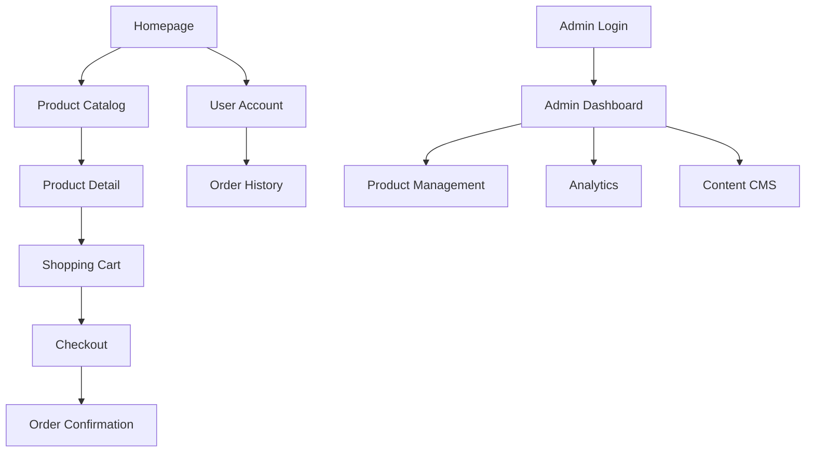

## 1. Product Overview
A luxury e-commerce platform for a high-end clothing brand featuring a sophisticated, responsive design inspired by premium fashion houses like Louis Vuitton. The platform provides seamless shopping experiences across desktop and mobile devices with comprehensive admin management capabilities.

The product solves the need for modern luxury brands to establish a premium online presence with full e-commerce functionality, content management, and business analytics while maintaining brand exclusivity and aesthetic appeal.

## 2. Core Features

### 2.1 User Roles
| Role | Registration Method | Core Permissions |
|------|---------------------|------------------|
| Customer | Email/Social login via Supabase | Browse products, add to cart, place orders, view order history |
| Admin | Invitation-only registration | Full CMS access, analytics dashboard, inventory management |

### 2.2 Feature Module
Our luxury e-commerce platform consists of the following main pages:
1. **Homepage**: Hero banner, featured collections, brand story section, newsletter signup
2. **Product Catalog**: Category filtering, product grid, search functionality
3. **Product Detail**: Image gallery, size selection, add to cart, related products
4. **Shopping Cart**: Item management, quantity updates, proceed to checkout
5. **Checkout**: Shipping address, payment processing, order confirmation
6. **User Account**: Profile management, order history, saved addresses
7. **Admin Dashboard**: Product management, order tracking, analytics, content CMS

### 2.3 Page Details
| Page Name | Module Name | Feature description |
|-----------|-------------|---------------------|
| Homepage | Hero Banner | Auto-rotating luxury imagery with smooth transitions and call-to-action buttons |
| Homepage | Featured Collections | Display curated product collections with hover effects and quick-view functionality |
| Homepage | Newsletter | Email capture with validation and welcome email integration |
| Product Catalog | Category Navigation | Hierarchical category menu with luxury brand styling |
| Product Catalog | Product Grid | Responsive grid layout with lazy loading and infinite scroll |
| Product Catalog | Search & Filter | Real-time search with price range, size, color filters |
| Product Detail | Image Gallery | Multiple product images with zoom functionality and fullscreen view |
| Product Detail | Size Selector | Interactive size guide with availability indicators |
| Product Detail | Add to Cart | Size validation, quantity selection, success notifications |
| Shopping Cart | Item Management | Update quantities, remove items, calculate totals with tax |
| Shopping Cart | Cart Summary | Display subtotal, shipping, tax calculations |
| Checkout | Address Form | Multi-step form with validation and address autocomplete |
| Checkout | Payment Processing | Secure payment gateway integration with error handling |
| User Account | Profile Settings | Update personal information, change password |
| User Account | Order History | View past orders with status tracking and details |
| Admin Dashboard | Product Management | CRUD operations for products with image upload to Supabase |
| Admin Dashboard | Analytics Overview | Sales metrics, user activity, inventory levels |
| Admin Dashboard | Content CMS | Update business name, logo, homepage content |

## 3. Core Process

### Customer Flow
Users land on the luxury homepage, browse curated collections or search specific items, view detailed product information with high-quality images, add desired items to cart, proceed through secure checkout with address and payment information, receive order confirmation and tracking updates.

### Admin Flow
Admins authenticate through secure login, access comprehensive dashboard with sales analytics and inventory status, manage product catalog including images and descriptions, update website content and branding elements, monitor user activity and order fulfillment.

## 4. User Interface Design

### 4.1 Design Style
- **Primary Colors**: Deep black (#000000), pristine white (#FFFFFF), luxury gold (#D4AF37)
- **Secondary Colors**: Soft gray (#F5F5F5), charcoal (#2C2C2C), accent bronze (#CD7F32)
- **Button Style**: Minimalist rectangular with subtle hover animations and luxury typography
- **Typography**: Elegant serif fonts for headers, clean sans-serif for body text
- **Layout Style**: Full-width sections with generous white space, card-based product displays
- **Icons**: Thin-line luxury aesthetic, custom SVG icons with consistent stroke width

### 4.2 Page Design Overview
| Page Name | Module Name | UI Elements |
|-----------|-------------|-------------|
| Homepage | Hero Banner | Full-screen luxury imagery with subtle parallax, elegant typography overlay, discrete navigation dots |
| Product Catalog | Product Cards | Hover-activated quick view, minimalist design with product name and price, luxury spacing ratios |
| Product Detail | Image Gallery | Left-aligned main image with thumbnail strip, smooth zoom on hover, fullscreen modal option |
| Shopping Cart | Cart Items | Clean table layout with product images, inline quantity editing, prominent checkout button |
| Admin Dashboard | Analytics Cards | Dark theme with data visualization charts, clean metric cards with trend indicators |

### 4.3 Responsiveness
Desktop-first design approach with mobile optimization. Luxury aesthetic maintained across all breakpoints with touch-friendly interactions on mobile devices. Images scale responsively while maintaining quality and aspect ratios.