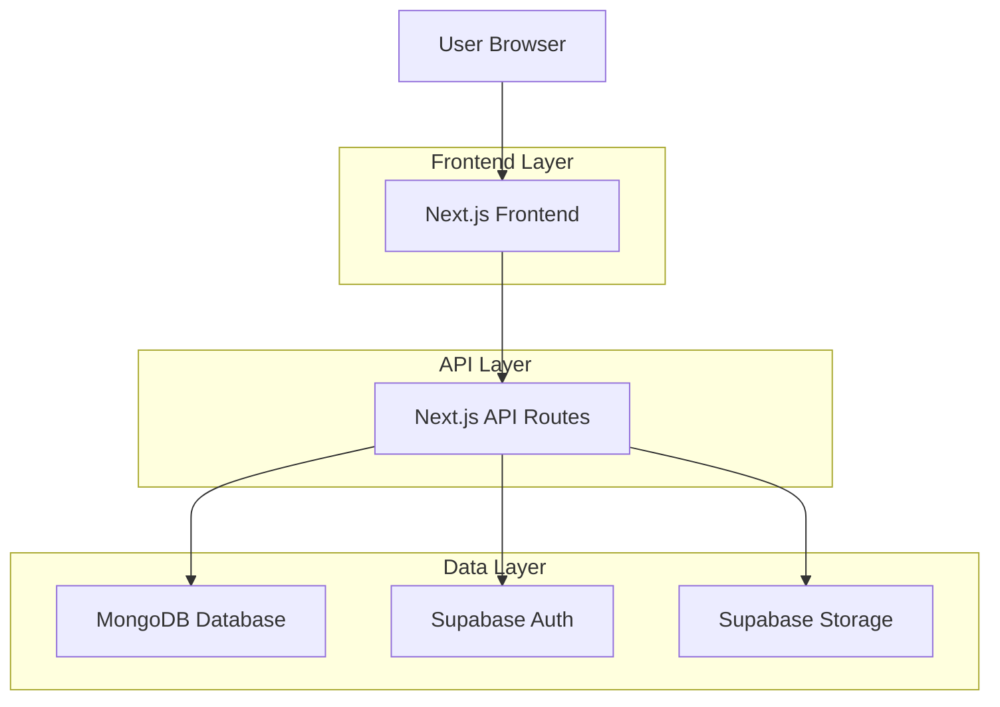
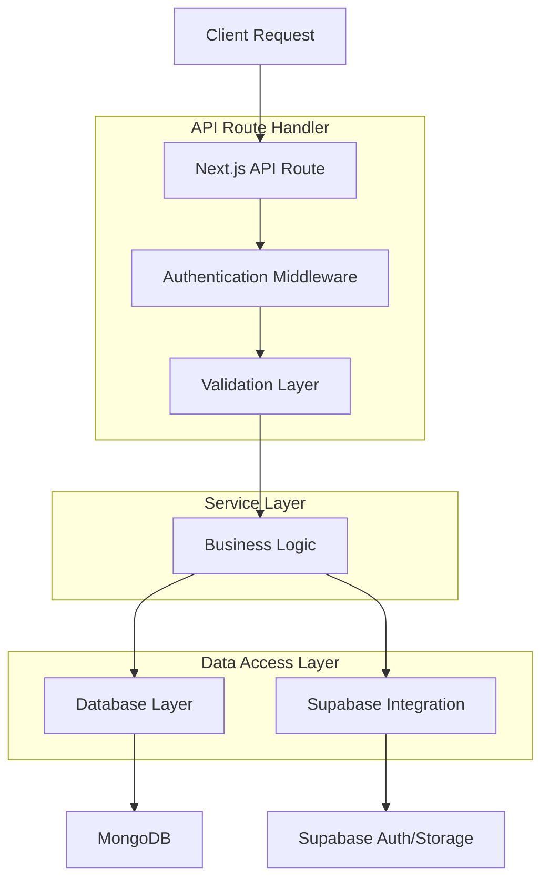
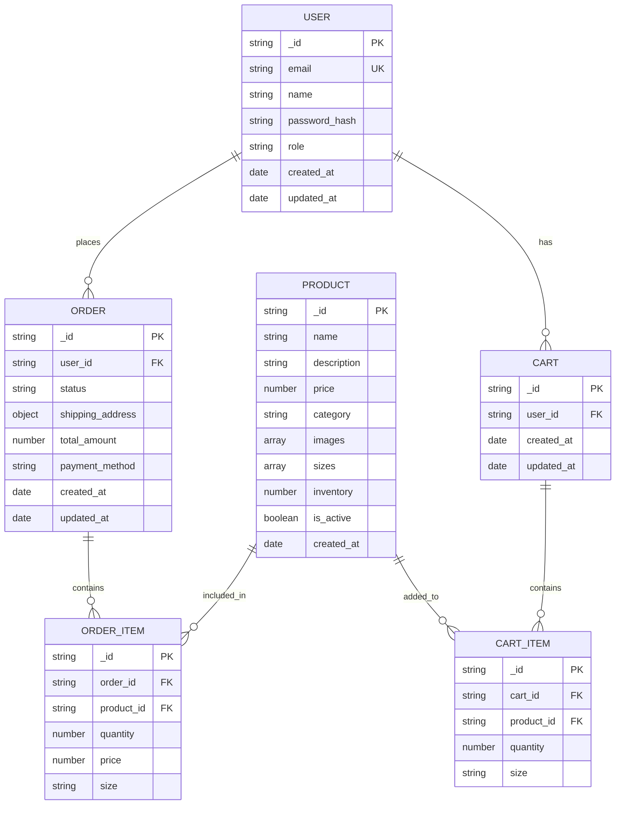

## 1. Architecture Design



## 2. Technology Description

- **Frontend**: Next.js@14 + Tailwind CSS@3 + JavaScript
- **Initialization Tool**: create-next-app
- **Backend**: Next.js API Routes (built-in)
- **Database**: MongoDB@6
- **Authentication**: Supabase Auth
- **File Storage**: Supabase Storage
- **State Management**: React Context API
- **Image Processing**: Next.js Image Optimization

## 3. Route Definitions

| Route | Purpose |
|-------|---------|
| / | Homepage with luxury hero banner and featured collections |
| /products | Product catalog with filtering and search |
| /products/[id] | Individual product detail page with image gallery |
| /cart | Shopping cart with item management |
| /checkout | Multi-step checkout process |
| /account | User account dashboard |
| /account/orders | Order history and tracking |
| /admin | Admin dashboard login |
| /admin/dashboard | Main admin dashboard with analytics |
| /admin/products | Product management interface |
| /admin/content | CMS for website content |
| /api/auth/* | Authentication API endpoints |
| /api/products/* | Product CRUD operations |
| /api/orders/* | Order processing APIs |
| /api/upload | Image upload to Supabase |

## 4. API Definitions

### 4.1 Authentication APIs

**User Registration**
```
POST /api/auth/register
```

Request:
| Param Name | Param Type | isRequired | Description |
|------------|------------|------------|-------------|
| email | string | true | User email address |
| password | string | true | User password |
| name | string | true | Full name |

Response:
| Param Name | Param Type | Description |
|------------|------------|-------------|
| user | object | User data with id and email |
| session | object | Supabase session token |

**User Login**
```
POST /api/auth/login
```

Request:
| Param Name | Param Type | isRequired | Description |
|------------|------------|------------|-------------|
| email | string | true | User email address |
| password | string | true | User password |

### 4.2 Product APIs

**Get Products**
```
GET /api/products
```

Query Parameters:
| Param Name | Param Type | isRequired | Description |
|------------|------------|------------|-------------|
| category | string | false | Product category filter |
| page | number | false | Pagination page number |
| limit | number | false | Items per page |

**Create Product (Admin)**
```
POST /api/products
```

Request:
| Param Name | Param Type | isRequired | Description |
|------------|------------|------------|-------------|
| name | string | true | Product name |
| description | string | true | Product description |
| price | number | true | Product price |
| category | string | true | Product category |
| images | array | true | Array of Supabase image URLs |
| sizes | array | true | Available sizes |
| inventory | number | true | Stock quantity |

### 4.3 Order APIs

**Create Order**
```
POST /api/orders
```

Request:
| Param Name | Param Type | isRequired | Description |
|------------|------------|------------|-------------|
| items | array | true | Array of product items with quantities |
| shipping_address | object | true | Shipping address details |
| payment_method | string | true | Payment method type |
| total_amount | number | true | Total order amount |

## 5. Server Architecture Diagram



## 6. Data Model

### 6.1 Data Model Definition



### 6.2 Data Definition Language

**Users Collection**
```javascript
// MongoDB Schema for Users
db.createCollection("users", {
  validator: {
    $jsonSchema: {
      bsonType: "object",
      required: ["email", "name", "password_hash", "role"],
      properties: {
        email: { bsonType: "string", pattern: "^\\S+@\\S+\\.\\S+$" },
        name: { bsonType: "string", minLength: 2 },
        password_hash: { bsonType: "string" },
        role: { enum: ["customer", "admin"] },
        created_at: { bsonType: "date" },
        updated_at: { bsonType: "date" }
      }
    }
  }
})

// Indexes
db.users.createIndex({ "email": 1 }, { unique: true })
db.users.createIndex({ "role": 1 })
```

**Products Collection**
```javascript
// MongoDB Schema for Products
db.createCollection("products", {
  validator: {
    $jsonSchema: {
      bsonType: "object",
      required: ["name", "description", "price", "category", "images", "sizes", "inventory"],
      properties: {
        name: { bsonType: "string", minLength: 1 },
        description: { bsonType: "string", minLength: 10 },
        price: { bsonType: "number", minimum: 0 },
        category: { bsonType: "string" },
        images: { bsonType: "array", items: { bsonType: "string" } },
        sizes: { bsonType: "array", items: { bsonType: "string" } },
        inventory: { bsonType: "number", minimum: 0 },
        is_active: { bsonType: "bool" },
        created_at: { bsonType: "date" }
      }
    }
  }
})

// Indexes
db.products.createIndex({ "category": 1 })
db.products.createIndex({ "is_active": 1 })
db.products.createIndex({ "price": 1 })
```

**Orders Collection**
```javascript
// MongoDB Schema for Orders
db.createCollection("orders", {
  validator: {
    $jsonSchema: {
      bsonType: "object",
      required: ["user_id", "status", "shipping_address", "total_amount", "payment_method"],
      properties: {
        user_id: { bsonType: "string" },
        status: { enum: ["pending", "confirmed", "shipped", "delivered", "cancelled"] },
        shipping_address: {
          bsonType: "object",
          required: ["street", "city", "state", "zip", "country"],
          properties: {
            street: { bsonType: "string" },
            city: { bsonType: "string" },
            state: { bsonType: "string" },
            zip: { bsonType: "string" },
            country: { bsonType: "string" }
          }
        },
        total_amount: { bsonType: "number", minimum: 0 },
        payment_method: { bsonType: "string" },
        created_at: { bsonType: "date" },
        updated_at: { bsonType: "date" }
      }
    }
  }
})

// Indexes
db.orders.createIndex({ "user_id": 1 })
db.orders.createIndex({ "status": 1 })
db.orders.createIndex({ "created_at": -1 })
```